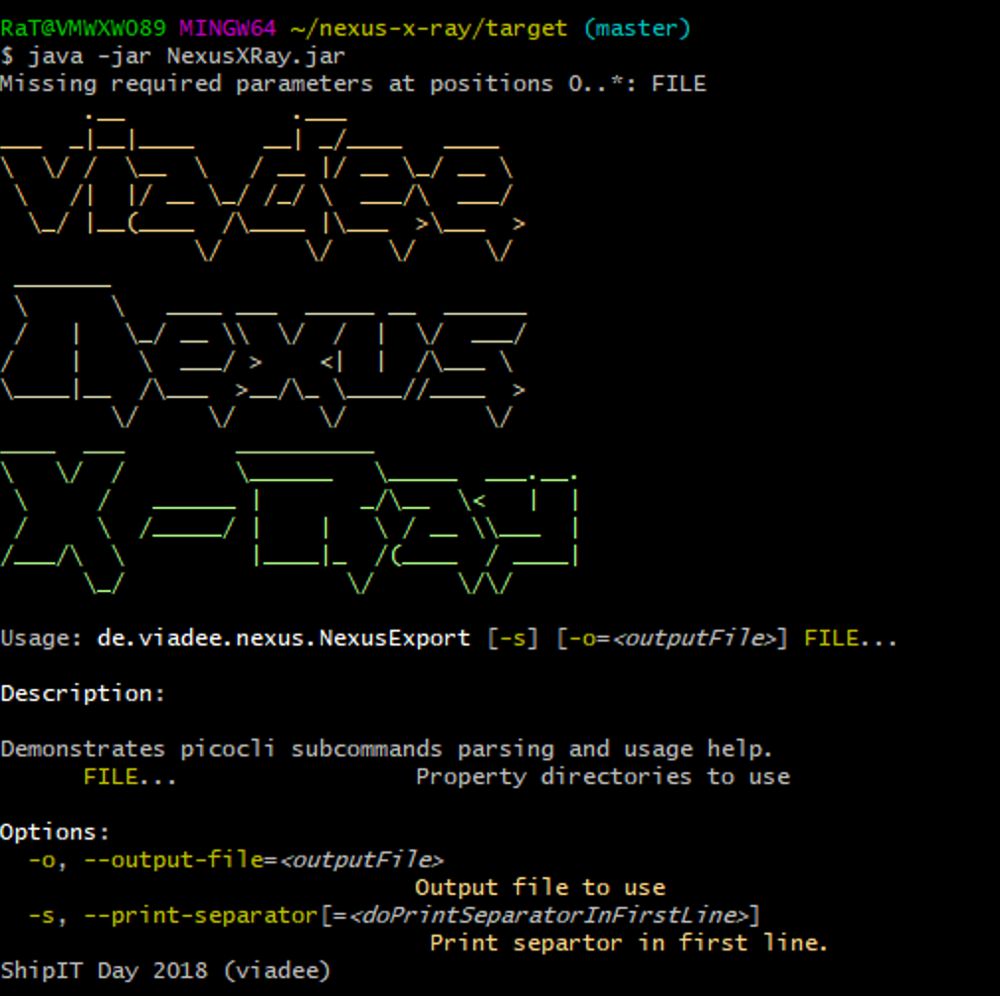

# Nexus X-Ray

This Project is to analyze an existing Sonatype Nexus Repository 
installation, to identify projects or artifacts with high disk usage. 

It comes with a command-line interface where the target paths are 
being passed. An output .csv is generated and can be visualized
with the given R diagram templates.

## Setup

Building this project requires Maven to be installed. Simply 
call `mvn install` to package and install a fat-jar that
can be used on the target machine.

## Dependencies

All dependencies for the CLI are given with the included `pom.xml`. 
You should install R Studio to create diagrams.

## Usage

Blabla
